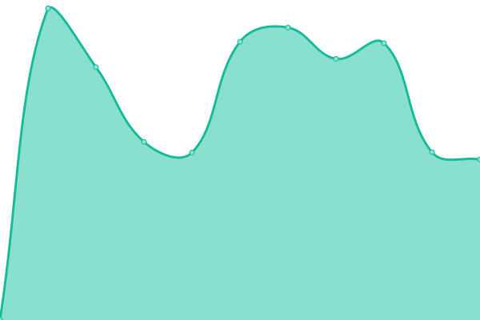

# [📈 Live Status](https://demo.upptime.js.org): <!--live status--> **🟧 Partial outage**

With [Upptime](https://upptime.js.org), you can get your own unlimited and free uptime monitor and status page, powered entirely by a GitHub repository. We use [Issues](https://github.com/ipme/upptime/issues) as incident reports, [Actions](https://github.com/ipme/upptime/actions) as uptime monitors, and [Pages](https://demo.upptime.js.org) for the status page.

<!--start: status pages-->
<!-- This summary is generated by Upptime (https://github.com/upptime/upptime) -->
<!-- Do not edit this manually, your changes will be overwritten -->
<!-- prettier-ignore -->
| URL | Status | History | Response Time | Uptime |
| --- | ------ | ------- | ------------- | ------ |
|  [ATzzz](https://atzzz.com) | 🟩 Up | [a-tzzz.yml](https://github.com/ipme/upptime/commits/HEAD/history/a-tzzz.yml) | 

 1620ms
     
 | 

<a href="https://ipme.github.io/upptime/history/a-tzzz">44.67%</a>
    

|  [MZkkk](https://mzkkk.com) | 🟩 Up | [m-zkkk.yml](https://github.com/ipme/upptime/commits/HEAD/history/m-zkkk.yml) | 

 1220ms
     
 | 

<a href="https://ipme.github.io/upptime/history/m-zkkk">44.53%</a>
    

|  [RssHub](https://rsshub.isrss.com) | 🟩 Up | [rss-hub.yml](https://github.com/ipme/upptime/commits/HEAD/history/rss-hub.yml) | 

 1098ms
     
 | 

<a href="https://ipme.github.io/upptime/history/rss-hub">59.91%</a>
    

|  [NewRSS](https://isrss.com) | 🟩 Up | [new-rss.yml](https://github.com/ipme/upptime/commits/HEAD/history/new-rss.yml) | 

 1146ms
     
 | 

<a href="https://ipme.github.io/upptime/history/new-rss">59.79%</a>
    

|  [IPv6 test](forwardemail.net) | 🟥 Down | [i-pv6-test.yml](https://github.com/ipme/upptime/commits/HEAD/history/i-pv6-test.yml) | 

 0ms
     
 | 

<a href="https://ipme.github.io/upptime/history/i-pv6-test">100.00%</a>
    

<!--end: status pages-->

[**Visit our status website →**](https://demo.upptime.js.org)

## 📄 License

- Powered by: [Upptime](https://github.com/upptime/upptime)
- Code: [MIT](./LICENSE) © [Anand Chowdhary](https://anandchowdhary.com), supported by [Pabio](https://pabio.com)
- Data in the `./history` directory: [Open Database License](https://opendatacommons.org/licenses/odbl/1-0/)
