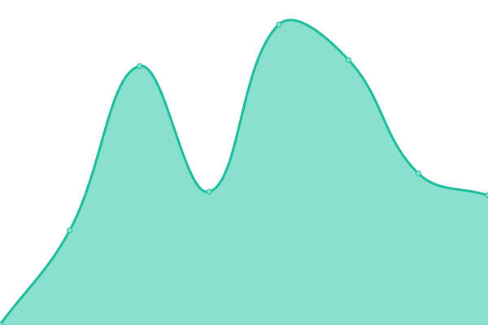
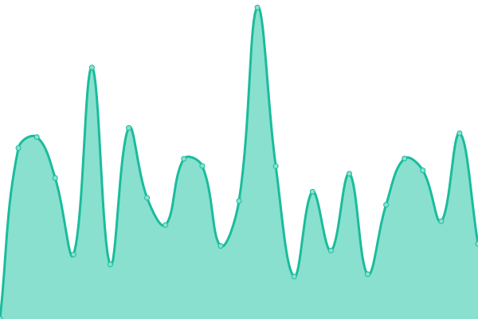
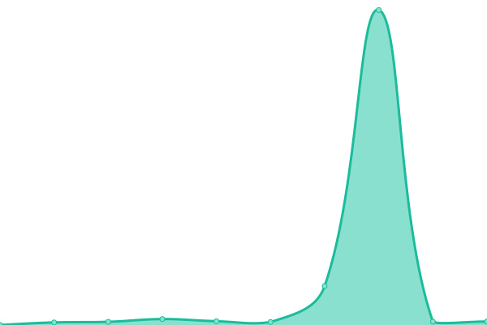

# [📈 Live Status](https://uptime.atzzz.com): <!--live status--> **🟧 部分停机**

With [Upptime](https://upptime.js.org), you can get your own unlimited and free uptime monitor and status page, powered entirely by a GitHub repository. We use [Issues](https://github.com/ipme/upptime/issues) as incident reports, [Actions](https://github.com/ipme/upptime/actions) as uptime monitors, and [Pages](https://demo.upptime.js.org) for the status page.

<!--start: status pages-->
<!-- This summary is generated by Upptime (https://github.com/upptime/upptime) -->
<!-- Do not edit this manually, your changes will be overwritten -->
<!-- prettier-ignore -->
| 链接 | 状态 | 历史 | 响应时间 | 正常运行时间 |
| --- | ------ | ------- | ------------- | ------ |
|  [ATzzz](https://atzzz.com) | 🟥 停机 | [a-tzzz.yml](https://github.com/ipme/upptime/commits/HEAD/history/a-tzzz.yml) | 

 2401毫秒
     
 | 

<a href="https://uptime.atzzz.com/history/a-tzzz">70.56%</a>
    

|  [Note](https://note.atzzz.com) | 🟩 正常运行 | [note.yml](https://github.com/ipme/upptime/commits/HEAD/history/note.yml) | 

 558毫秒
     
 | 

<a href="https://uptime.atzzz.com/history/note">100.00%</a>
    

|  [GitHub Proxy](https://github.atzzz.com) | 🟥 停机 | [git-hub-proxy.yml](https://github.com/ipme/upptime/commits/HEAD/history/git-hub-proxy.yml) | 

 410毫秒
     
 | 

<a href="https://uptime.atzzz.com/history/git-hub-proxy">97.09%</a>
    

|  [ATzzz-img](https://imgs.atzzz.com) | 🟥 停机 | [a-tzzz-img.yml](https://github.com/ipme/upptime/commits/HEAD/history/a-tzzz-img.yml) | 

 325毫秒
     
 | 

<a href="https://uptime.atzzz.com/history/a-tzzz-img">97.35%</a>
    

|  [MZkkk](https://mzkkk.com) | 🟥 停机 | [m-zkkk.yml](https://github.com/ipme/upptime/commits/HEAD/history/m-zkkk.yml) | 

 3741毫秒
     
 | 

<a href="https://uptime.atzzz.com/history/m-zkkk">30.38%</a>
    

|  [RssHub](https://rsshub.isrss.com) | 🟥 停机 | [rss-hub.yml](https://github.com/ipme/upptime/commits/HEAD/history/rss-hub.yml) | 

 519毫秒
     
 | 

<a href="https://uptime.atzzz.com/history/rss-hub">88.43%</a>
    

|  [Hugging-Face-RSSHub](https://huggingface.co/spaces/cnwww/RSSHub) | 🟩 正常运行 | [hugging-face-rss-hub.yml](https://github.com/ipme/upptime/commits/HEAD/history/hugging-face-rss-hub.yml) | 

 123毫秒
     
 | 

<a href="https://uptime.atzzz.com/history/hugging-face-rss-hub">100.00%</a>
    

|  [NewRSS](https://isrss.com) | 🟥 停机 | [new-rss.yml](https://github.com/ipme/upptime/commits/HEAD/history/new-rss.yml) | 

 3586毫秒
     
 | 

<a href="https://uptime.atzzz.com/history/new-rss">66.01%</a>
    

|  [Google IPv6](http://www.google.com) | 🟩 正常运行 | [google-i-pv6.yml](https://github.com/ipme/upptime/commits/HEAD/history/google-i-pv6.yml) | 

 56毫秒
     
 | 

<a href="https://uptime.atzzz.com/history/google-i-pv6">100.00%</a>
    

|  [RssHub-app](https://rsshub.app) | 🟥 停机 | [rss-hub-app.yml](https://github.com/ipme/upptime/commits/HEAD/history/rss-hub-app.yml) | 

 124毫秒
     
 | 

<a href="https://uptime.atzzz.com/history/rss-hub-app">0.00%</a>
    

<!--end: status pages-->

[**Visit our status website →**](https://uptime.atzzz.com)

## 📄 License

- Powered by: [Upptime](https://github.com/upptime/upptime)
- Code: [MIT](./LICENSE) © [Anand Chowdhary](https://anandchowdhary.com), supported by [Pabio](https://pabio.com)
- Data in the `./history` directory: [Open Database License](https://opendatacommons.org/licenses/odbl/1-0/)
